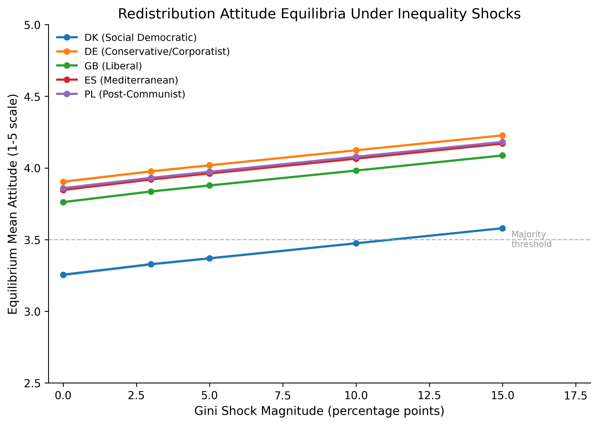
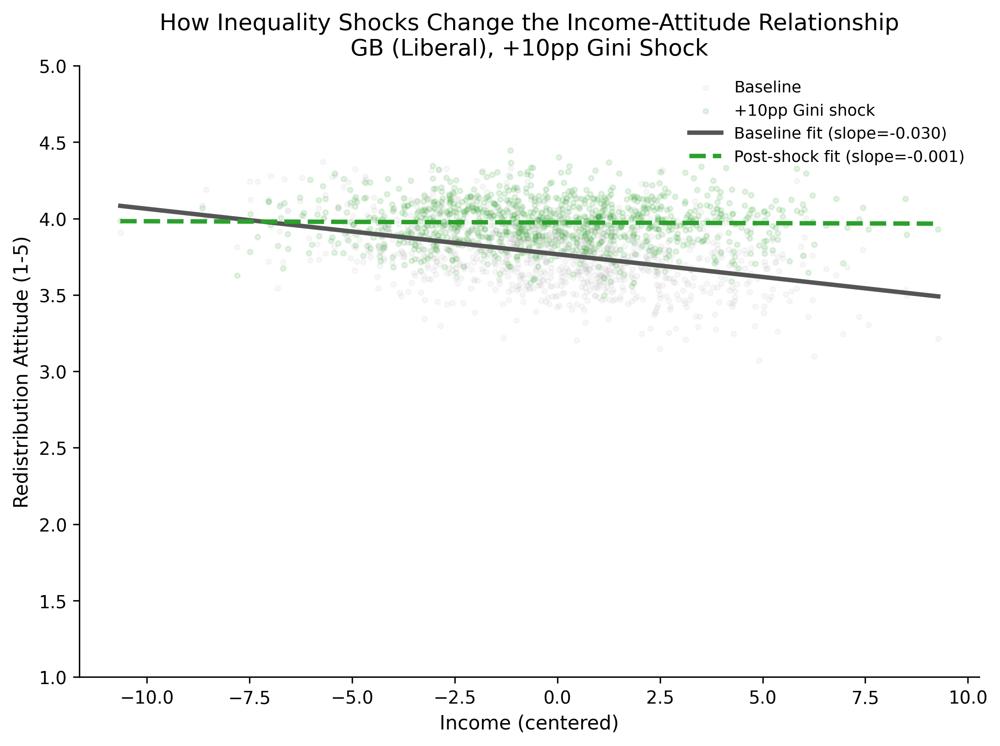
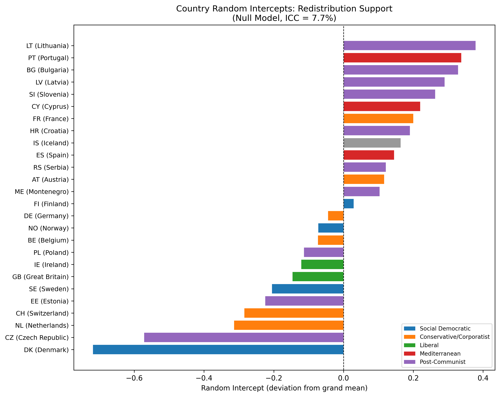
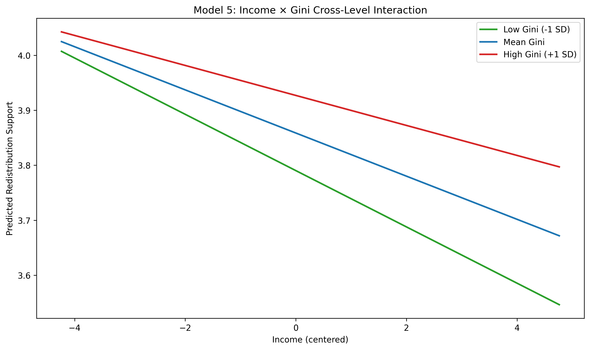

# ESS Redistribution Analysis

**Multilevel analysis of redistribution preferences across 28 European countries**

How do individual income, political ideology, and country-level inequality interact to shape attitudes toward redistribution? This project uses European Social Survey Round 9 (2018) data with multilevel models to answer that question.

## Key Findings

- **7.7% of variance** in redistribution support is between countries (ICC = 0.077), justifying multilevel modeling
- **Income reduces redistribution support** (b = -0.039, p < 0.001) - the self-interest effect
- **Ideology is the strongest predictor** (b = -0.083, p < 0.001) - right-wing orientation reduces support
- **Income x Gini interaction is significant** (b = 0.012, p = 0.002) - higher inequality *weakens* the negative income effect, meaning rich people in unequal countries are relatively more supportive of redistribution than rich people in equal countries
- **Ideology x Gini interaction is significant** (b = 0.028, p = 0.024) - higher inequality weakens ideological polarization on redistribution
- **AI exposure does NOT directly predict redistribution preferences** (b = -0.014, p = 0.857) - the direct "technological threat" hypothesis is rejected. The effect operates indirectly: AI-driven economic restructuring increases inequality, which activates the significant income x Gini interaction

**Sample:** 31,393 individuals across 26 countries (complete cases from 48,436 in 28 countries)

## Simulation: Inequality Shocks and Attitude Equilibria

The simulation takes the empirical regression coefficients and asks: what happens to redistribution attitude equilibria when AI-driven labor displacement increases inequality?

**Design:** 5 representative countries (DK, DE, GB, ES, PL -- one per welfare regime type), 1,000 agents each, Gini shocks of 3-15 percentage points with simultaneous income distribution compression. 50 replications per condition. Shock magnitudes motivated by Minniti, Prettner & Venturini (2025), who find AI innovation reduces labor share by 0.5-1.6% in European regions.

**Key findings:**

- **Gradual drift, not tipping.** The income x Gini interaction (beta = 0.012) produces linear drift of approximately 0.022 attitude points per Gini percentage point. No discontinuous tipping was observed at any shock level.
- **Regime differences are in baselines, not sensitivity.** All welfare regime types shift at the same rate. Denmark, Germany, Spain, Poland, and the UK respond identically to equal-magnitude shocks.
- **A 10pp Gini shock eliminates the income gradient.** The income-attitude slope flattens from -0.030 to approximately -0.001, meaning rich and poor converge in redistribution preferences.





- **Denmark is the only threshold-crossing case,** reaching majority redistribution support (~3.5) at approximately 15pp Gini increase -- because it starts closest to the threshold, not because it is more sensitive.

The absence of tipping is itself a finding. It indicates that the income x Gini channel alone is insufficient for discontinuous attitude transitions under plausible AI-driven inequality scenarios. Tipping, if it occurs, likely requires additional mechanisms: compounding across multiple attitudinal domains, media framing dynamics, or peer network effects not captured in cross-sectional survey data.

### Caterpillar Plot: Country Random Intercepts



### Cross-Level Interaction: Income x Inequality



## Data

- **Individual-level:** European Social Survey Round 9 (2018), Stata format
- **Country-level:** Gini coefficients, GDP per capita, unemployment rates (OECD/World Bank)
- **Institutional:** EPL, ALMP spending, union density, social spending (OECD/ICTWSS)
- **AI exposure:** Felten, Raj & Seamans (2021) AIOE scores, aggregated via Eurostat LFS employment weights

## Methods

Multilevel linear models (individuals nested in countries) estimated via REML using `statsmodels.MixedLM`:

| Model | Description |
|-------|-------------|
| M1 | Null model (ICC) |
| M2 | Individual-level predictors (income, ideology, trust, demographics) |
| M3 | + Country-level predictors (Gini, GDP, unemployment) |
| M4 | Random slopes for income |
| M5 | Cross-level interaction: income x Gini |
| M6 | Random slopes for ideology |
| M7 | Cross-level interaction: ideology x Gini |
| M14 | + AI exposure main effect (null: p = 0.857) |
| M15 | AI exposure x welfare regime interactions (all null) |
| M16 | Social exposure composite (null: p = 0.857) |

Level-1 predictors are grand-mean centered. Level-2 predictors are z-score standardized.

## Repository Structure

```
ess-redistribution-analysis/
├── config.py                    # Paths, variable mappings, regime classifications
├── requirements.txt             # Python dependencies
├── data/
│   ├── raw/                     # ESS9e03_3.dta (user must download)
│   ├── processed/               # Analysis-ready dataset
│   └── external/                # Country-level CSV files
├── src/                         # Data loading, preparation, modeling, visualization
├── notebooks/
│   ├── 01_data_exploration.ipynb
│   ├── 02_data_preparation_clean.ipynb
│   ├── 03_replication_analysis.ipynb    # Core 7-model sequence
│   ├── 04_welfare_regime_extension.ipynb
│   └── 05_ai_exposure_extension.ipynb
├── simulation/                  # Agent-based Gini shock simulation
│   ├── config.py                # Loads parameters from empirical models
│   ├── model.py                 # Country/agent classes, update rule
│   ├── run_experiments.py       # Shock experiments, batch runs
│   └── analysis.py              # Result visualization
├── outputs/
│   ├── figures/                 # All plots (including simulation/)
│   └── tables/                  # Coefficient tables, fit statistics
└── docs/                        # Methodology, variable codebook
```

## Reproduction

1. Clone this repository
2. Install dependencies: `pip install -r requirements.txt`
3. Download ESS Round 9 data (`ESS9e03_3.dta`) from https://ess.sitehost.iu.edu/ and place in `data/raw/`
4. Run notebooks in order: 01 -> 02 -> 03 (-> 04 -> 05 optional)

No R installation needed - all models use Python's `statsmodels`.

## Author

Kaleb Mazurek - MSc Social Science Research, University of Amsterdam

## License

MIT License. ESS and OECD data subject to their respective usage policies.
