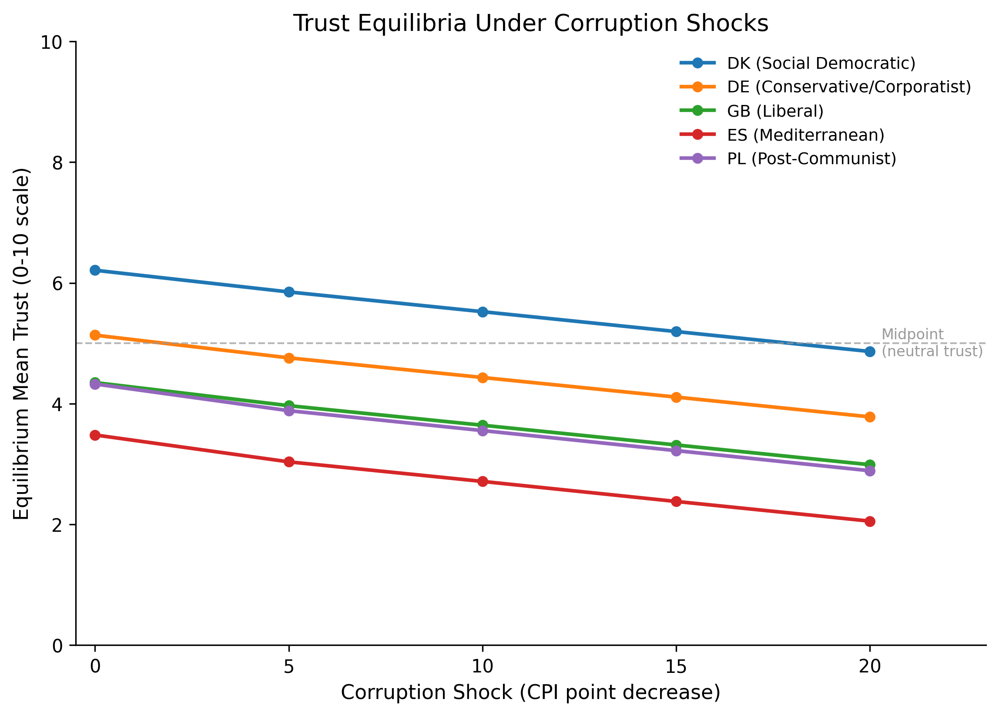
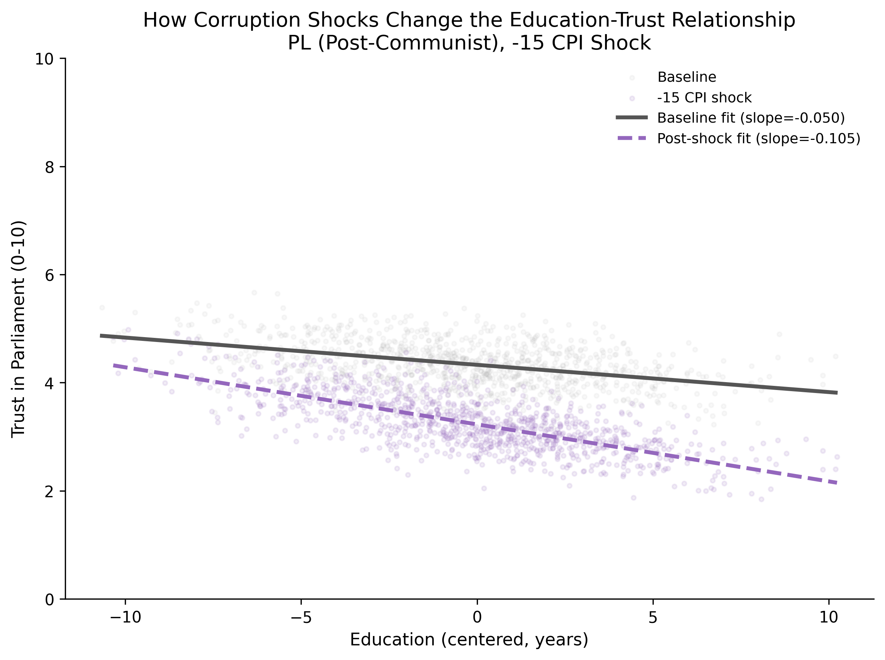
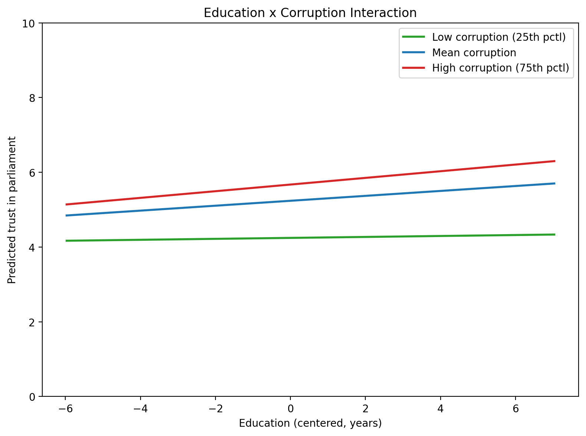

# ESS Redistribution and Trust Analysis

**Multilevel analysis of redistribution preferences and institutional trust across 28 European countries**

What predicts redistribution preferences and institutional trust across European countries, and which domain is more vulnerable to tipping under AI-driven institutional stress? This project uses European Social Survey Round 9 (2018) data with multilevel models and agent-based simulation to answer that question.

## Key Findings

### Empirical results

- **Redistribution ICC = 8.0%** across 28 countries. Income x Gini interaction significant (p = 0.002): higher inequality weakens the negative income effect on redistribution support.
- **Trust ICC = 18.1%** - more than double the redistribution ICC. Education x corruption interaction significant (p < 0.001, coef = 0.050): educated citizens are more sensitive to governance quality. In clean countries, education increases trust; in corrupt countries, the effect weakens.
- **AI exposure has no direct effect** on redistribution preferences (p = 0.857). The effect operates indirectly through AI's impact on inequality and governance quality.

### Simulation results

- **Redistribution: gradual drift, no tipping.** The income x Gini interaction (beta = 0.012) produces linear drift of ~0.022 points per Gini percentage point. No discontinuous tipping at any shock level. Welfare regimes differ in baselines, not sensitivity.
- **Trust: tipping observed.** Corruption shocks of -15 CPI points produce shifts exceeding 1.0 point (on a 0-10 scale) in all 5 countries tested. The trust-governance feedback loop (erosion -> disengagement -> governance decline -> further erosion) amplifies shocks by ~40% beyond the direct effect.
- **The structural difference:** trust has a self-reinforcing feedback loop that redistribution lacks. The domain most critical for democratic stability is also the most tipping-prone.

**Sample:** 31,393 individuals across 26 countries (redistribution models); 31,033 across 25 countries (trust models)

### Redistribution simulation


### Trust simulation





### Cross-level interactions




## Data

- **Individual-level:** European Social Survey Round 9 (2018), Stata format
- **Country-level:** Gini coefficients, GDP per capita, unemployment rates (OECD/World Bank)
- **Institutional:** EPL, ALMP spending, union density, social spending (OECD/ICTWSS)
- **AI exposure:** Felten, Raj & Seamans (2021) AIOE scores, aggregated via Eurostat LFS employment weights
- **Corruption:** Transparency International CPI 2018

## Methods

Multilevel linear models (individuals nested in countries) estimated via REML using `statsmodels.MixedLM`. Two parallel model sequences test different cross-level interactions for each dependent variable:

**Redistribution models (M1-M7, M14-M16):**

| Model | Description |
|-------|-------------|
| M1 | Null model (ICC = 8.0%) |
| M2 | Individual-level predictors (income, ideology, trust, demographics) |
| M3 | + Country-level predictors (Gini, GDP, unemployment) |
| M4 | Random slopes for income |
| M5 | Cross-level interaction: income x Gini (p = 0.002) |
| M6 | Random slopes for ideology |
| M7 | Cross-level interaction: ideology x Gini (p = 0.024) |
| M14-16 | AI exposure models (all null) |

**Trust models (T1-T7):**

| Model | Description |
|-------|-------------|
| T1 | Null model (ICC = 18.1%) |
| T2 | Individual predictors (education, income, ideology, demographics) |
| T3 | + Country-level predictors (Gini, GDP, unemployment, corruption) |
| T4 | Random slopes for education |
| T5 | Cross-level interaction: education x corruption (p < 0.001) |
| T6 | Cross-level interaction: education x Gini (p = 0.045, drops out in full model) |
| T7 | Full model |

Level-1 predictors are grand-mean centered. Level-2 predictors are z-score standardized.

## Repository Structure

```
ess-redistribution-analysis/
├── config.py                    # Paths, variable mappings, regime classifications
├── requirements.txt             # Python dependencies
├── data/
│   ├── raw/                     # ESS9e03_3.dta (user must download)
│   ├── processed/               # Analysis-ready dataset
│   └── external/                # Country-level CSV files
├── src/                         # Data loading, preparation, modeling, visualization
├── notebooks/
│   ├── 01_data_exploration.ipynb
│   ├── 02_data_preparation_clean.ipynb
│   ├── 03_replication_analysis.ipynb    # Core 7-model redistribution sequence
│   ├── 04_welfare_regime_extension.ipynb
│   └── 05_ai_exposure_extension.ipynb
├── scripts/
│   ├── trust_model_analysis.py          # Trust model sequence (T1-T7)
│   └── alternative_dv_icc_check.py      # ICC comparison across DVs
├── simulation/
│   ├── model.py / run_experiments.py    # Redistribution: Gini shock simulation
│   ├── trust_model.py / trust_experiments.py  # Trust: corruption shock simulation
│   └── analysis.py / trust_analysis.py  # Visualization for both
├── outputs/
│   ├── figures/                 # All plots (simulation/, trust/)
│   └── tables/                  # Coefficient tables, fit statistics
└── docs/                        # Methodology, variable codebook, findings
```

## Reproduction

1. Clone this repository
2. Install dependencies: `pip install -r requirements.txt`
3. Download ESS Round 9 data (`ESS9e03_3.dta`) from https://ess.sitehost.iu.edu/ and place in `data/raw/`
4. Run notebooks in order: 01 -> 02 -> 03 (-> 04 -> 05 optional)
5. Trust models: `python -m scripts.trust_model_analysis`
6. Simulations: `python -m simulation.run_experiments` and `python -m simulation.trust_experiments`

No R installation needed - all models use Python's `statsmodels`.

## Author

Kaleb Mazurek - MSc Social Science Research, University of Amsterdam

## License

MIT License. ESS and OECD data subject to their respective usage policies.
